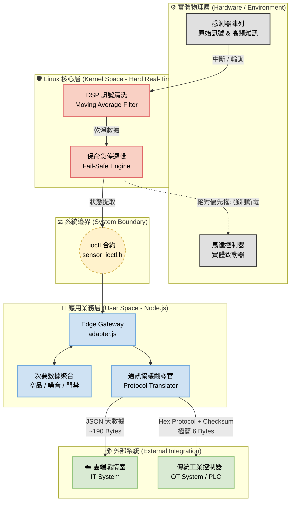

# 🏭 Industrial IT/OT Safety Gateway (基於 Linux Kernel 之工業級安全閘道器)

> **一句話簡介：** 專為 **工業人機協作 (HRC)** 與 **高可靠度邊緣運算 (Edge Computing)** 設計的軟體定義閘道器 (Software-Defined Gateway) 與虛擬感測中樞 (Virtual Sensor Hub)。
> 透過分離 Linux Kernel Space (硬即時控制與邊緣濾波) 與 User Space (通訊協議轉換)，解決傳統單一架構無法兼顧「IT 雲端大數據聚合」與「OT 底層極低延遲防護 (Fail-Safe)」的業界痛點。

## 🏗️ 系統架構 (System Architecture)

本專案採用三層式異質運算架構，展示「軟體定義硬體」與「IT/OT 解耦」的設計哲學：


## ✨ 核心工程價值 (Key Features)

* 🛡️ **工安級隔離 (Safety-Critical Isolation):** 保命邏輯直接在 Kernel Timer 內反射觸發，實作零延遲的硬體防護。
* ⏱️ **確定性採樣 (Deterministic Sampling):** 擺脫 OS 排程帶來的 Jitter，確保底層每 100ms 絕對執行一次感測。
* 🔌 **軟體定義硬體 (Software-Defined Hardware):** 嚴格定義 `sensor_ioctl.h` 合約，使邏輯層與物理硬體完全脫鉤。
* 🚀 **虛擬化開發 (Mock-Driven Development):** 內建硬體模擬器，無須連接真實硬體即可進行架構驗證。
* 📉 **核心級訊號清洗 (Kernel-Space DSP):** 在 Linux 驅動底層實作滑動平均濾波器 (Moving Average Filter)，於物理雜訊進入 User Space 前即時抑制，確保防護邊界的絕對穩定。
* 🔀 **IT/OT 雙軌通訊 (Dual-Track Telemetry):** 閘道器兼具協議翻譯能力，向上發布雲端友善的 JSON 負載，向下則針對傳統控制器 (PLC/MCU) 壓制出僅 6 Bytes 且含校驗碼 (Checksum) 的工業級 Hex 封包。

## 📂 專案結構 (Directory Structure)

```text
.
├── decisions/          # 架構決策紀錄 (ADR)
├── kernel/             # Linux LKM 驅動原始碼
│   ├── include/        # 跨層共享的 IOCTL 合約定義
│   └── src/            # mock_sensor.c (保命機制與虛擬硬體)
└── user/               # Node.js 邊緣運算層
    └── adapter.js      # 系統資料聚合與 API 轉發
```

## 🚀 系統輸出展示 (IT/OT 解耦架構)

本閘道器無縫橋接了雲端 (IT) 與工廠現場 (OT) 的通訊鴻溝，於終端機即時展示兩種截然不同的資料流聚合結果：

```text
======================================================
☁️  [IT-Layer] Cloud JSON Payload (190 Bytes)
{
  timestamp: '2026-02-21T18:15:43.770Z',
  safety_subsystem: { distance_mm: 193, status: 'NORMAL' },
  environment_subsystem: { pm25: 32, noise_db: 85 },
  access_subsystem: { last_scan: 'NO_CARD' }
}
⚙️  [OT-Layer] Industrial Hex Payload (6 Bytes)
📡 UART TX -> [ 0xAA 0x01 0x00 0xC1 0x00 0x6C ]
======================================================
```

## 🚀 快速啟動 (Getting Started)

**1. 編譯與載入核心模組 (Kernel Space)**
```bash
cd kernel
make
sudo insmod src/mock_sensor.ko
dmesg | tail # 驗證驅動是否存活
```

**2. 啟動邊緣聚合器 (User Space)**
```bash
cd user
npm install
sudo node adapter.js
```

## 📜 架構決策紀錄 (ADRs)
詳細的系統設計與技術選型考量，請參閱：
* [ADR-001: 針對安全關鍵邊緣系統的混合架構](decisions/ADR-001-hybrid-architecture.md)
* [ADR-002: 閘道器中的 IT/OT 雙軌通訊協定轉換](./decisions/ADR-002-it-ot-protocol-translation.md)