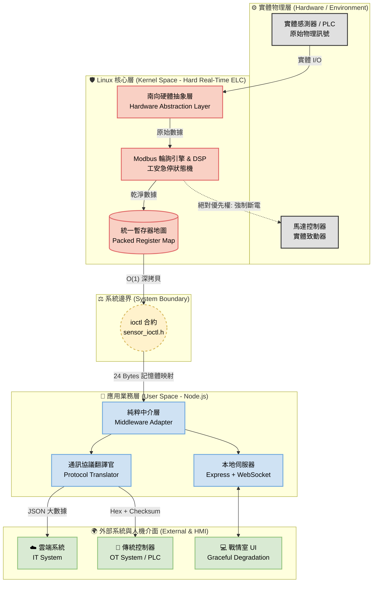

# 🏭 Industrial IT/OT Safety Gateway (基於 Linux Kernel 之工業級安全閘道器)

> **一句話簡介：** 專為 **工業人機協作 (HRC)** 與 **高可靠度邊緣運算 (Edge Computing)** 設計的軟體定義閘道器 (Software-Defined Gateway) 與 **邊緣邏輯控制器 (Edge Logic Controller, ELC)**。
> 透過分離 Linux Kernel Space (硬即時控制、Modbus 輪詢與統一暫存器) 與 User Space (純粹通訊協議轉換與戰略 UI)，解決傳統單一架構無法兼顧「IT 雲端大數據聚合」、「OT 底層極低延遲防護 (Fail-Safe)」以及「斷線時的人機防呆」的業界痛點。

## 🏗️ 系統架構 (System Architecture)

本專案採用三層式異質運算架構，展示「軟體定義硬體」、「IT/OT 解耦」與「邊緣自洽」的設計哲學：



## ✨ 核心工程價值 (Key Features)
* 🗄️ **邊緣邏輯控制器 (Edge Logic Controller):** 捨棄 User Space 的資料造假，將 Linux Kernel 轉化為底層輪詢大腦。在 Kernel 建立統一的「暫存器映射表 (Register Map)」，達成感測器 Input Register 與馬達 Coil 的硬體級聯鎖 (Hardware Interlock)。
* 🔒 **中斷上下文防禦 (Interrupt Context Safety):** 洞察 mod_timer 軟中斷無法睡眠的底層限制，將互斥鎖全面重構為 自旋鎖 (spin_lock_irqsave)，徹底消滅 Kernel Panic 隱患，確保硬即時狀態機的記憶體一致性。
* 🛡️ **跨層 ABI 記憶體防禦 (Cross-Language ABI Stability):** 透過在 C 結構體導入 __attribute__((packed))，強制剝奪編譯器的記憶體對齊填充 (Padding)，確保底層核心與上層 Node.js 依靠 Fixed Offset 讀取 Buffer 時的絕對一致性。
* 🌐 **邊緣自洽戰情室 (Edge-Autonomous Dashboard):** 內建 Express 與 WebSocket 伺服器，達成零 WAN 依賴的區域網路即時可視化。

* 🚨 **優雅降級與心理防呆 (Graceful Degradation):** 前端實作 Watchdog 看門狗，斷線時自動凍結畫面並切換為「SOP 指揮官模式」，防止人員恐慌誤操作 (Human-in-the-Loop 安全設計)。
* 🔀 **IT/OT 雙軌通訊 (Dual-Track Telemetry):** 閘道器向上發布雲端友善的 JSON 負載，向下則針對傳統控制器壓制出僅 6 Bytes 且含校驗碼 (Checksum) 的工業級 Hex 封包。

## 📂 專案結構 (Directory Structure)

```text
.
├── decisions/          # 架構決策與事後剖析 (ADR & Postmortem)
├── kernel/             # Linux LKM 驅動原始碼
│   ├── include/        # 跨層共享的 IOCTL 暫存器合約定義
│   └── src/            # mock_elc_core.c (HAL、保命機制、自旋鎖與狀態機)
├── tests/              # 系統診斷與壓力測試工具
│   └── elc_diag.c      # Pthreads 多核心併發壓測程式
└── user/               # Node.js 邊緣運算層
    ├── public/         # Vanilla JS/CSS 打造之高對比工業戰情室 UI
    └── adapter.js      # 純粹中介層：記憶體映射解析、API 轉發與 Web 伺服器
```

## 🚀 系統輸出展示 (IT/OT 解耦架構)

本閘道器無縫橋接了雲端 (IT) 與工廠現場 (OT) 的通訊鴻溝，於終端機即時展示兩種截然不同的資料流聚合結果：

```text
======================================================
☁️  [IT-Layer] Cloud JSON Payload (190 Bytes)
{
  timestamp: '2026-02-21T18:15:43.770Z',
  safety_subsystem: { distance_mm: 193, status: 'NORMAL' },
  environment_subsystem: { pm25: 32, noise_db: 85 },
  access_subsystem: { last_scan: 'NO_CARD' }
}
⚙️  [OT-Layer] Industrial Hex Payload (6 Bytes)
🚨 [ALARM] MOTOR OFFLINE! OT-UART TX -> [ 0xAA 0x01 0x00 0xC1 0x01 0x6D ]
======================================================
```

## 🚀 快速啟動 (Getting Started)

**1. 編譯與載入核心模組 (Kernel Space)**
```bash
cd kernel
make
sudo insmod src/mock_elc_core.ko
dmesg | tail # 驗證驅動與 ELC 輪詢引擎是否存活
```

**2. 啟動邊緣聚合器 (User Space)**
```bash
cd user
npm install
sudo node adapter.js # 備註：此處需 sudo 權限以存取 /dev/mock_elc 字元設備。量產環境將透過 udev rules 配置權限以符合最小權限原則。
```
**3. 執行極限壓力測試 (Stress Test)**
```bash
cd tests
gcc elc_diag.c -o elc_diag -pthread
sudo ./elc_diag # 驗證 SMP 併發下的 O(1) 深拷貝效能與零死鎖防禦
```

## 📜 架構決策紀錄 (ADRs)
詳細的系統設計與技術選型考量，請參閱：
* [ADR-001: 針對安全關鍵邊緣系統的混合架構](decisions/ADR-001-hybrid-architecture.md)
* [ADR-002: 閘道器中的 IT/OT 雙軌通訊協定轉換](./decisions/ADR-002-it-ot-protocol-translation.md)
* [ADR-003: 邊緣自洽的戰情室與人機防呆機制](decisions/ADR-003-edge-autonomous-dashboard.md)
* [ADR-004: 統一 OT 資料聚合於 Kernel 層](decisions/ADR-004-unified-ot-aggregation.md)
* [ADR-005: 實作深拷貝 $O(1)$ 與 SMP 併發壓力測試標準]（decisions/ADR-005-smp-stress-test-and-o1-deepcopy.md）
* [POSTMORTEM-001: 系統規模對齊與 Kernel Deadlock 事件](decisions/POSTMORTEM-001-kernel-deadlock.md)
* [POSTMORTEM-002: 物理 I/O 阻塞盲點與 Kernel Thread 遷移藍圖](decisions/POSTMORTEM-002-io-blocking-and-kthread-migration.md)